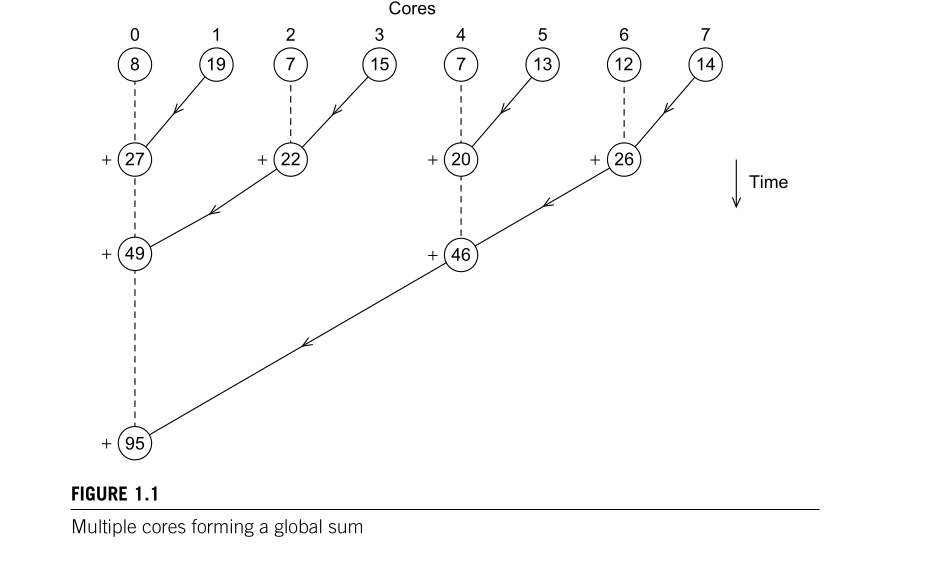

6. Derive formulas for the number of receives and additions that core 0 carries out using:  
   a. the original pseudo-code for a global sum  
   b. the tree-structured global sum.  
Make a table showing the numbers of receives and additions carried out by core
0 when the two sums are used with 2, 4, 8, . . . , 1024 cores.

## Tabela mostrando o número de receives, ou joins que o core 0 terá  

- A coluna Cores representa o número de núcleos, que estão em potência de 2.
- A coluna Naive, é o número de receives que o core 0 terá caso utilizado
a abordagem ingenua do core 0 esperar todos os outros e somar todo de uma vez.
- A coluna Tree é o número de receives que o core 0 terá utilizando a abordagem em árvore.

| Cores | Naive | Tree |
|-------|-------|------|
|    2  |   1   |  1   |
|    4  |   3   |  2   |
|    8  |   7   |  3   |
|   16  |   15  |  4   |
|   32  |   31  |  5   |
|   64  |   63  |  6   |
|  128  |  127  |  7   |
|  256  |  255  |  8   |
|  512  |  512  |  9   |
| 1024  | 1023  |  10  |

Podemos observar claramente que a abordagem ingênua segue a formula,
**_p -1_** e quando usamos a árvore, percebemos que a cada 2 núcleos,
o número de ligações amentar em 1, ou seja, **_log(p)_** de base 2.
Podemos ver o número de ligações crescendo linearmente com cada dois núcleos na imagem abaixo
