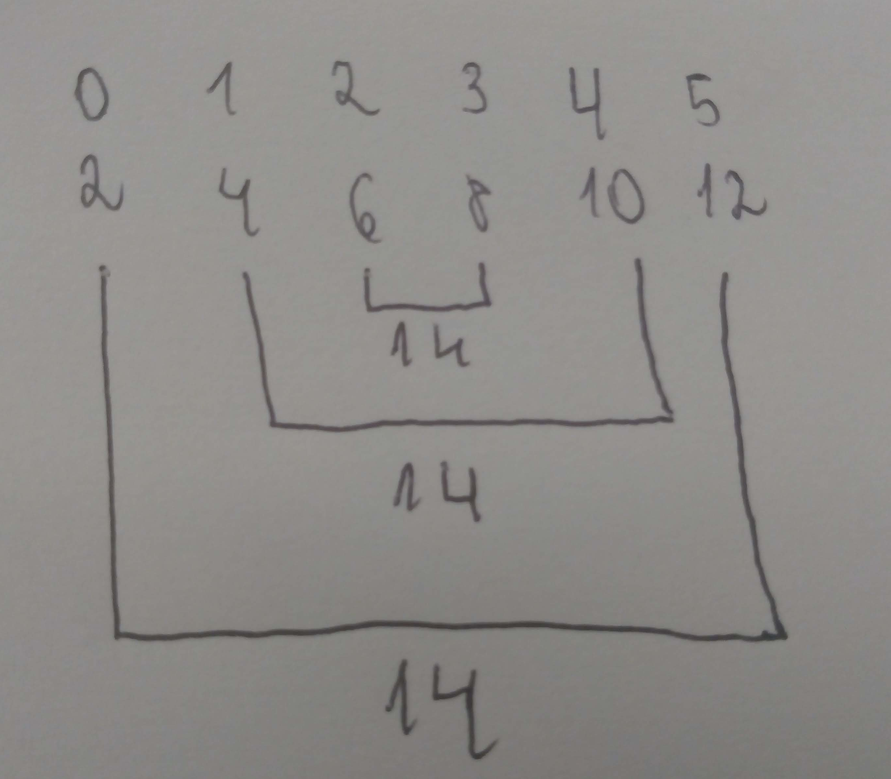

# Questão 2

We’ve implicitly assumed that each call to **_Compute_next_value_** requires roughly the same amount of work as the other calls. How would you change your answer to the preceding question if call _i_ = _k_ requires _k_ + 1 times as much work as the call with _i_ = 0? So if the first call (_i_ = 0) requires 2 milliseconds, the second call (_i_ = 1) requires 4, the third (_i_ = 2) requires 6, and so on.

## Somatório de Gauss

Exemplo,  Supondo que k = 10, temos o seguinte vetor de índice:  
indices = [0, 1, 2, 3, 4, 5, 6, 7, 8, 9]  
utilizando a lógica da somatório de gauss e organizando os indicies temos um array normalizado:  
normalized_array =   [ [0, 9], [1, 8], [2, 7], [3, 6], [4, 5] ]  
onde o custo  de cada índice do normalized_array é igual, por tanto
podemos usar o algoritmo da questão 1 aplicado ao normalized_array
resultando:

| Thread | normalized_array |
| ------ | ---------------- |
| 1      | 0,1              |
| 2      | 2,3              |
| 3      | 4                |

| Thread | Compute_next_value | cost |
| ------ | ------------------ | ---- |
| 1      | 0, 9,1, 8          | 44   |
| 2      | 2, 7,3, 6          | 44   |
| 3      | 4, 5               | 22   |