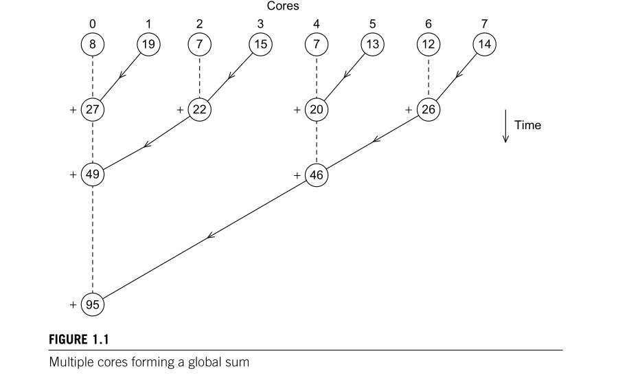

# Questão 3

Try to write pseudo-code for the tree-structured global sum illustrated in
Figure 1.1. Assume the number of cores is a power of two (1, 2, 4, 8, . . . ).


Para criar a árvore, foi considerado que o vetor principal já foi igualmente espaçado entre as _p_ threads, usando o algoritmo da questão 1.


## Representação de um Nó

Neste caso foi representado o nó, como uma estrutura que possui um vetor de vizinhos e outro ponteiro para um vetor de inteiros, na prática,
o ponteiro para um vetor de inteiros, seria usando o design pattern chamado **Future**, ou um **Option\<Future\>**, ou **Option\<thread\>**. 

Também foi criado dois construtores um construtor que representa,
a inicialização do Nó por meio dos seus vizinhos a esquerda e direita,
usando na criação de nós intermediários  da árvore, e a inicialização
do Nó por meio do seu dado, os nós inicializados por meio dos dados
abstrai os **núcleos** ou as **threads** que estão sendo usadas para
executar o algoritmo de alto custo computacional. 

```c++
class Node
{
public:
    std::vector<Node *> neighborhoods;
    std::vector<int> *data;
    Node(Node *left, Node *right)
    {
        this->neighborhoods.push_back(left);
        this->neighborhoods.push_back(right);
        this->data = nullptr;
    }
    Node(std::vector<int> *data)
    {
        this->data = data;
    }
    ~Node()
    {
        delete this->data;
    }
};

```
## Função que cria a Árvore

Para criar a Árvore foi feita uma função recursiva que
a partir do nível mais baixo da árvore cria a raiz, ou seja,
a partir um vetor com _p_ Nós ,a função vai sendo chamada recursivamente,
onde a cada chamada vai-se criando um nível acima da árvore, até
que se atinja a raiz, onde a cada nível o número de nós é dividido
por 2. **Caso o número de nós inicial não for divisível pro 2, o algoritmo não funciona**

```c++
std::vector<Node *> create_tree_from_core_nodes(std::vector<Node *> nodes)
{
    auto size = nodes.size();

    if (size / 2 == 1)
    {
        auto left = nodes[0];
        auto right = nodes[1];
        receive_value(left, right);  // Left receive value from right
        return {left};
    }

    auto new_nodes = std::vector<Node *>{};

    for (auto i = 0; i < size; i += 2)
    {
        auto left = nodes[i]; 
        auto right = nodes[i + 1];
        receive_value(left, right); // Left receive value from right
        new_nodes.push_back(left);
    }

    return create_tree_from_core_nodes(new_nodes);
}

Node *create_new_tree(std::vector<Node *> nodes)
{
    return create_tree_from_core_nodes(nodes)[0];
}
```


Após criar a árvore basta percorrer-lá recursivamente, lembrando que na prática
**_compute_data_**, seria um _join_, ou um _await_, de uma thread.

```c++
int compute_data(std::vector<int> *data)
{
    auto total = 0;
    auto size = data->size();
    for (auto i = 0; i < size; i++)
    {
        total += data->at(i);
    }

    return total;
}
int compute_node(Node &node)
{

    int result_data = node.data == nullptr ? 0 : compute_data(node.data);

    for (auto neighborhood : node.neighborhoods)
        result_data += compute_node(*neighborhood);

    return result_data;
}
```
