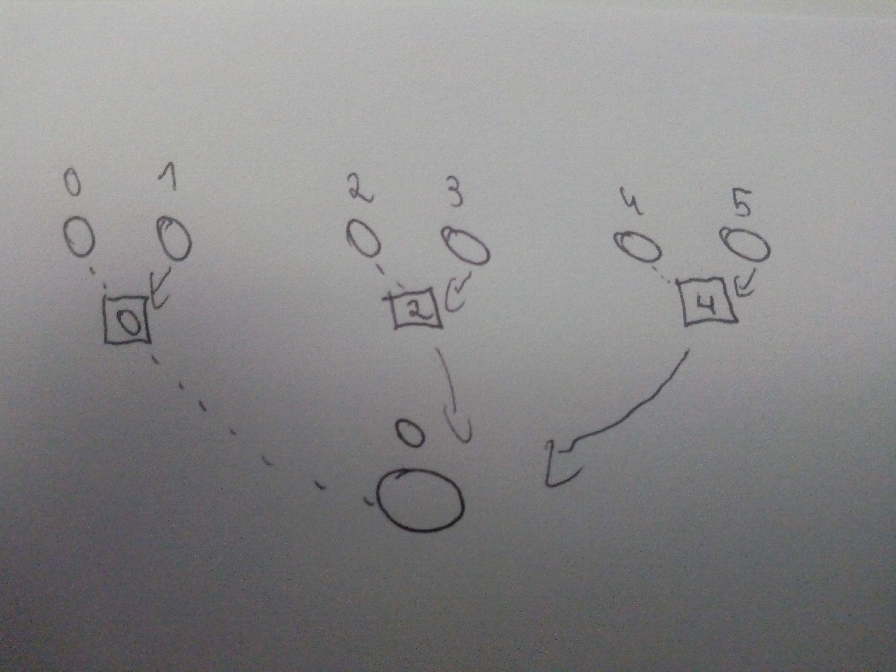

# Questão 5

What happens if your pseudo-code in Exercise 1.3 or Exercise 1.4 is run when the number of cores is not a power of two (e.g., 3, 5, 6, 7) ? Can you modify the
pseudo-code so that it will work correctly regardless of the number of cores ?


## Entendendo o que acontece quanto os número de núcleos não é da potencia de 2

Se por exemplo, o número de cores, ou Nós for 3 por exemplo, existirá nós que serão  "esquecidos" no algoritmo, por tanto
o algoritmo não funcionará corretamente.
```c++
auto size = nodes.size();// size = 3

if (size >> 1 == 1) // alteração.
{
    auto left = nodes[0];
    auto right = nodes[1];
    // node[2] foi esquecido
    receive_value(left, right); // Left receive value from right
    return {left};
}
```

ou se o por exemplo o número de nós for 7, a última iteração do laço **_for_**, os indices  **_i_**, **_i+1_**, serão respectivamente
6 e 7, ou seja será acessado um endereço inválido **_7_**, uma vez que os indices vão de 0 até 6.
```c++
    auto new_nodes = std::vector<Node *>{};

    for (auto i = 0; i < size; i += 2)
    { 
        auto left = nodes[i]; 
        auto right = nodes[i + 1];
        receive_value(left, right); // Left receive value from right
        new_nodes.push_back(left);
    }

    return create_new_tree_bitwise(new_nodes);
```


Para isso foram feitas as seguintes modificações:  
 - adicionado condicionamento para verificar se o tamanho é igual 3 
 - alterado o bitwise para apenas um comparador **_size ==2_**
 - verificado se o tamanho dos nós é par, caso nãos seja adicionado uma logica extra.

```c++
std::vector<Node *> create_new_tree_bitwise(std::vector<Node *> nodes)
{

    auto size = nodes.size();

    if (size == 2)
    {
        auto left = nodes[0];
        auto right = nodes[1];
        receive_value(left, right);
        return {left}; // Construtor C++ Moderno.
    }
    if (size == 3)
    {
        auto left = nodes[0];
        auto middle = nodes[1];
        auto right = nodes[2];
        receive_value(left, middle); // Left receive value from middle
        receive_value(left, right);  // Left receive value from right
        return {left};               // Construtor C++ Moderno.
    }

    auto new_nodes = std::vector<Node *>{};
    
    if (size % 2 != 0) // lógica extra.
    {
        size = size - 1;
        new_nodes.push_back(nodes[size]);
    }

    for (auto i = 0; i < size; i += 2)
    {
        auto left = nodes[i];
        auto right = nodes[i + 1];
        receive_value(left, right); // Left receive value from right
        new_nodes.push_back(left);
    }

    return create_new_tree_bitwise(new_nodes);
}
```
## Explicando a lógica extra
Além de adicionar uma verificação para saber se o tamanho é par,
foi adicionado dois comandos extras, o primeiro é alterar o tamanho (size), para um valor menor, uma vez que estávamos acessando um índice
maior que o permitido. Segundo foi adicionar o nó que não será percorrido
pelo laço para o vetor **_new_nodes_** que será a entrada da próxima função recursiva

```c++
 if (size % 2 != 0) // verificação se é par.
    {
        size = size - 1; //1
        new_nodes.push_back(nodes[size]); // 2
    }
```

## Explicando o novo caso base

Percebemos que além do 2/2 == 1, a divisão inteira de 3/2 também é igual 1. Por tanto além do caso base de quando o tamanho do vetor de nós ser igual a 2, temos que tratar também quando o número de nós ser igual a 3.

```c++
 if (size == 2)
    {
        auto left = nodes[0];
        auto right = nodes[1];
        receive_value(left, right);
        return {left}; // Construtor C++ Moderno.
    }
    if (size == 3)
    {
        auto left = nodes[0];
        auto middle = nodes[1];
        auto right = nodes[2];
        receive_value(left, middle); // Left receive value from middle
        receive_value(left, right);  // Left receive value from right
        return {left};               // Construtor C++ Moderno.
    }
```

 Como no exemplo abaixo, onde a segunda iteração do algoritmo o número de nós é 3.


