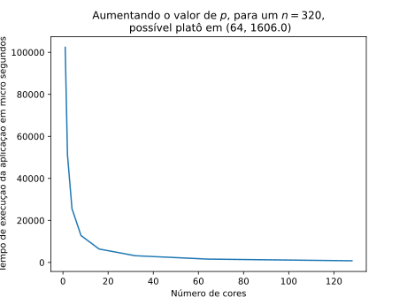
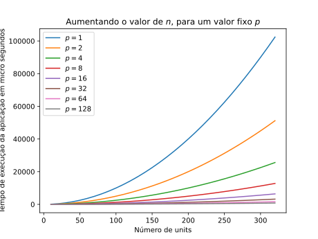
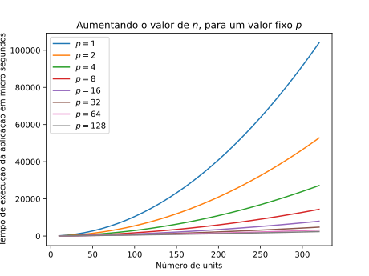
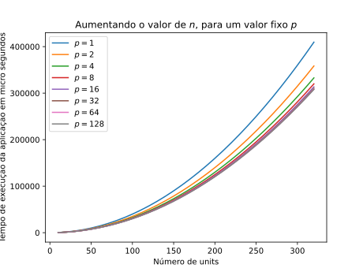

16.  
       1. Suppose the run-time of a serial program is given by $T_{serial} = n^2$ , where the units of the run-time are in microseconds. Suppose that a parallelization of this program has run-time $T_{parallel} = \frac{n^2}{p} + log_2(p)$. Write a program that finds the speedups and efficiencies of this program for various values of n and p. Run your program with $n = 10, 20, 40, . . . , 320$, and $p = 1, 2, 4, . . . , 128$. What happens to the speedups and efficiencies as p is increased and n is held fixed? What happens when p is fixed and n is increased ?

       2. Suppose that $T_{parallel} = \frac{T_{serial}}{p} + T_{overhead}$ . Also suppose that we fix $p$ and increase the problem size.   
            - Show that if $T_{overhead}$ grows more slowly than $T_{serial}$ , the parallel
             efficiency will increase as we increase the problem size.
            - Show that if, on the other hand, $T_{overhead}$ grows faster than $T_{serial}$, the parallel efficiency will decrease as we increase the problem size.


## 16 1

### What happens to the speedups and efficiencies as p is increased and n is held fixed ?



Podemos observar a Amadahl's law, "a lei de Amadahl diz: a menos que virtualmente todo o programa serial seja paralelizado, o possível speedup, ou  ganhado de performance  será muito limitado, independentemente dos números de cores disponíveis." Nó exemplo em questão, podemos observar que a partir de
32 cores, o tempo da aplicação fica estagnado por volta dos 1606 micro segundos.


###  What happens when p is fixed and n is 



Mesmo com da lei de Amdahl, podemos observar que o aumento de performance é bastante significante, valendo a pena paralelizar a aplicação, também pelo fato que os hardwares atualmente possuem mais
de um core.


## 16 2

### Show that if $T_{overhead}$ grows more slowly than $T_{serial}$ , the parallel efficiency will increase as we increase the problem size.



Sabendo que o tempo serial é o quadrático da entrada, considerei o
tempo de overhead sendo: $T_{overhead} = 5n$, ou seja, uma função linear. Comparando com o gráfico da letra **_a_** dificilmente é notado uma diferença entre os gráficos, podendo até ser desconsiderado.


### Show that if, on the other hand, $T_{overhead}$ grows faster than $T_{serial}$, the parallel efficiency will decrease as we increase the problem size.



Sabendo que o tempo serial é o quadrático da entrada, considerei o
tempo de overhead sendo: $T_{overhead} = 3T_{serial} = 3n^2$, ou seja, o overhead cresce 3 vezes mais que o serial. Comparando com o gráfico da letra **_a_**  podemos observar que paralelizar não é uma boa opção, pois
nem com $p =128$ consegue ser melhor do que com $p =1$, ou seja, não paralelizar, ou seja, a solução serial sem o overhead.


## Observações

Para essa atividade foi utilizado Python na sua versão **_3.10.4_**
para instalar as dependências do script e criar os gráficos:

```shell
# para criar um ambiente virtual, suponto que tenha python 3.10.4 instalado
python -mnenv .env
source .env/bin/activate
# instalando as dependências e executando a aplicação
pip install -r requirements.txt
python main.py
```