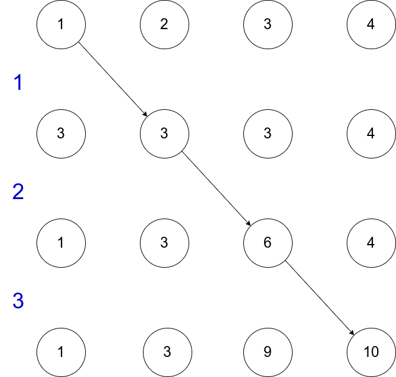
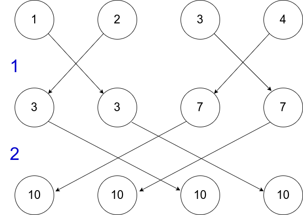

# Questão 11

Finding **prefix sums** is a generalization of global sum. Rather than simply finding the sum of $n$ values,  
$$x_0 + x_1 + \cdot \cdot \cdot + x_{n-1}$$  
the prefix sums are the n partial sums  
$$x_0, x_0 + x_1, x_0 + x_1 + x_2,   \cdot \cdot \cdot, x_0 + x_1 \cdot \cdot \cdot + x_{n-1}$$  
1. Devise a serial algorithm for computing the $n$ prefix sums of an array with $n$ elements.
2. Parallelize your serial algorithm for a system with $n$ processes, each of which is storing one of the _x_is_.
3. Suppose $n = 2^k$ for some positive integer $k$. Can you devise a serial algorithm and a parallelization of the serial algorithm so that the parallel algorithm requires only $k$ communication phases ?
4. MPI provides a collective communication function, MPI Scan, that can be used to compute prefix sums:
    ```c++
    int MPI Scan(
        void*        sendbuf_p /* in  */,
        void*        recvbuf_p /* out */,
        int          count     /* in  */,
        MPI_Datatype datatype  /* in  */,
        MPI_Op       op        /* in  */,
        MPI_Comm     comm      /* in  */);
    ```
    It operates on arrays with _count_ elements; both _sendbuf_p_ and _recvbuf_p_ should refer to blocks of _count_ elements of type _datatype_. The _op_ argument
    is the same as op for _MPI_Reduce_. Write an MPI program
    that generates a random array of _count_ elements on each
    MPI process, finds the prefix sums, and print the results.


## Prefix sums serial

```c++
#include <iostream>
#include <vector>
#include <numeric>
#include <assert.h>

std::vector<int> calculate_n_prefix_sums(std::vector<int> &v, int &n);
int prefix_sum(std::vector<int> &v, int &n);
void test_prefix_sums();

int main(int argc, char const *argv[])
{
    test_prefix_sums();

    return 0;
}

std::vector<int> calculate_n_prefix_sums(std::vector<int> &v, int &n)
{
    assert(n >= 1);

    std::vector<int> result(n);
    result[0] = v[0];

    for (int i = 1; i < n; i++)
        result[i] = result[i - 1] + v[i];

    return result;
}

void test_prefix_sums()
{
    std::vector<int> v{1, 2, 3, 4, 5, 6};
    auto n = 1;
    auto prefixs = calculate_n_prefix_sums(v, n);

    assert(prefixs.size() == 1);
    assert(prefixs[0] == v[0]);

    n = 2;
    prefixs = calculate_n_prefix_sums(v, n);

    assert(prefixs.size() == 2);
    assert(prefixs[0] == v[0]);
    assert(prefixs[1] == v[0] + v[1]);

    n = 3;
    prefixs = calculate_n_prefix_sums(v, n);

    assert(prefixs.size() == 3);
    assert(prefixs[0] == v[0]);
    assert(prefixs[1] == v[0] + v[1]);
    assert(prefixs[2] == v[0] + v[1] + v[2]);

    std::cout << "Passed in tests" << std::endl;
}
```

```bash
c++ question_11_serial.cpp -o question_11_serial 
./question_11_serial 
Passed in tests
```
Codigo fonte pode ser encontrado aqui: [question_11_serial.cpp](question_11_serial.cpp)

## Prefix sums MPI 
A figura a baixo, é um exemplo onde
a entrada é é um vetor $v = [1,2,3,4]$ e o número de processos
é igual a 4. Logo cada processo terá apenas um número. A ideia 
é focar só na transferência dos valores entre os processos.
Perceba que o processo raiz apenas envia o seu valor para o
próximo nó e que o último processo apenas recebe os valor
do nó anterior e que o número de sincronizações é $p-1$, onde
$p$ é um números de processos, no exemplo $p = 4$, por tanto
o número de sincronizações é $3$.




```c
#include <mpi.h>
#include <stdio.h>
#include <stdlib.h>
#include <string.h>
typedef struct input
{
    double *v_1;
    int vector_size;
    int input_size;
} input;

input read_input(int argc, char *argv[]);
input read_local_input(int argc, char *argv[], int my_rank, int comm_sz);
double *read_vector(char *input, int vector_size);

typedef struct range
{
    int first;
    int last;
} range;

range range_block_partition(int my_rank, int total_process, int input_size);

void print_vector(double *vector, int size);

double *send_global_vector_to_root(double *local_vector, int local_size, int global_size, int my_rank);
double *calculate_n_prefix_sums(double v[], int size);

void update_prefix_sums_vector(double vector[], int size, double value);
double receive_last_prefix_sum(int source_node, int message_tag);
void update_prefix_sums(int my_rank, double *local_prefix_sum, int vector_size, int message_tag);

int main(int argc, char *argv[])
{
    int my_rank;
    int comm_sz;

    int message_tag = 0;

    MPI_Init(&argc, &argv);

    MPI_Comm_rank(MPI_COMM_WORLD, &my_rank);
    MPI_Comm_size(MPI_COMM_WORLD, &comm_sz);

    input local_input = read_local_input(argc, argv, my_rank, comm_sz);
    double *local_prefix_sum = calculate_n_prefix_sums(local_input.v_1, local_input.vector_size);

    if (my_rank != 0) // is not root process
    {
        double last_prefix_sum_source_node = receive_last_prefix_sum(my_rank - 1, message_tag);

        update_prefix_sums_vector(local_prefix_sum, local_input.vector_size, last_prefix_sum_source_node);
    }

    if (my_rank != comm_sz - 1) // is not last process
    {
        double last_prefix_sum = local_prefix_sum[local_input.vector_size - 1];
        MPI_Send(&last_prefix_sum, 1, MPI_DOUBLE, my_rank + 1, message_tag, MPI_COMM_WORLD);
    }

    double *global_prefix_sum = send_global_vector_to_root(local_prefix_sum, local_input.vector_size, local_input.input_size, my_rank);
    if (my_rank == 0)
    {
        printf("\t\tResult\n");
        printf("Prefix sum: ");
        print_vector(global_prefix_sum, local_input.input_size);
        printf("\n");
    }

    MPI_Finalize();

    return 0;
}

double *send_global_vector_to_root(double *local_vector, int local_size, int global_size, int my_rank)
{
    double *global_vector = NULL;

    if (my_rank == 0)
    {
        global_vector = malloc(global_size * sizeof(double));
    }
    MPI_Gather(local_vector, local_size, MPI_DOUBLE, global_vector, local_size, MPI_DOUBLE, 0, MPI_COMM_WORLD);

    return global_vector;
}
input read_local_input(int argc, char *argv[], int my_rank, int comm_sz)
{
    input local_input;
    input total_input;

    total_input.v_1 = NULL;

    if (my_rank == 0)
    {
        total_input = read_input(argc, argv);

        printf("\t\tInput\n");
        printf("vector size %i\n", total_input.vector_size);
        printf("vector input: ");
        print_vector(total_input.v_1, total_input.vector_size);
        printf("\n");
    }

    MPI_Bcast(&total_input.vector_size, 1, MPI_INT, 0, MPI_COMM_WORLD);

    range r = range_block_partition(my_rank, comm_sz, total_input.vector_size);

    local_input.vector_size = r.last - r.first;
    local_input.v_1 = malloc(local_input.vector_size * sizeof(double));
    local_input.input_size = total_input.vector_size;

    MPI_Scatter(total_input.v_1, local_input.vector_size, MPI_DOUBLE, local_input.v_1, local_input.vector_size, MPI_DOUBLE, 0, MPI_COMM_WORLD);

    return local_input;
}

range range_block_partition(int my_rank, int total_process, int input_size)
{
    range r;

    int division = input_size / total_process;
    int rest = input_size % total_process;

    if (my_rank < rest)
    {
        r.first = my_rank * (division + 1);
        r.last = r.first + division + 1;
    }
    else
    {
        r.first = my_rank * division + rest;
        r.last = r.first + division;
    }

    return r;
}

double *read_vector(char *input, int vector_size)
{

    double *v = malloc(vector_size * sizeof(double));
    int current_vector_index = 0;

    for (size_t i = 0; input[i] != '\0'; i++)
    {

        if (input[i] != ',')
        {

            v[current_vector_index] = atoi(&input[i]);
            current_vector_index++;
        }
    }

    return v;
}

void print_vector(double *vector, int size)
{
    printf("[");
    for (int i = 0; i < size - 1; i++)
    {
        printf("%lf,", vector[i]);
    }
    printf("%lf]", vector[size - 1]);
}

input read_input(int argc, char *argv[])
{

    if (argc != 3)
    {
        printf("Número de entradas erradas\n");
        exit(1);
    }

    input result;

    result.vector_size = atoi(argv[1]);
    result.v_1 = read_vector(argv[2], result.vector_size);

    return result;
}

void update_prefix_sums(int my_rank, double *local_prefix_sum, int vector_size, int message_tag)
{
    int source_node = my_rank - 1;
    double last_prefix_sum_source_node;
    MPI_Recv(&last_prefix_sum_source_node, 1, MPI_DOUBLE, source_node, message_tag, MPI_COMM_WORLD, MPI_STATUS_IGNORE);
}

double receive_last_prefix_sum(int source_node, int message_tag)
{
    double last_prefix_sum_source_node;
    MPI_Recv(&last_prefix_sum_source_node, 1, MPI_DOUBLE, source_node, message_tag, MPI_COMM_WORLD, MPI_STATUS_IGNORE);

    return last_prefix_sum_source_node;
}

double *calculate_n_prefix_sums(double v[], int size)
{

    double *result = malloc(size * sizeof(double));

    result[0] = v[0];

    for (int i = 1; i < size; i++)
        result[i] = result[i - 1] + v[i];

    return result;
}

void update_prefix_sums_vector(double vector[], int size, double value)
{
    for (int i = 0; i < size; i++)
        vector[i] += value;
}
```

## Prefix sums MPI butterfly structured

Nó caso para reduzirmos o número de sincronizações, temos que
utilizar a estrutura butterfly, idealmente nós não deveríamos
implementar a estrutura, uma vez que **implementar** ela é
de forma ótima é responsabilidade do próprio MPI. Deveríamos apenas utilizar e passar os parâmetros
adequados. - "Alternatively, we might have the processes exchange
partial results instead of using one-way communications. Such a communication pattern is sometimes called a butterfly (see Figure 3.9). Once again, we don’t want to have to decide on which structure to use, or how to code it for optimal performance."
Perceba que utilizando a estrutura butterfly atente os requisitos.
$n =4$, implica o número de sincronizações é $2$ e caso tenha número de cores suficiente, quando $n =8$, o número de   número de sincronizações é $3$, ou seja, $n = 2^{k}$.
