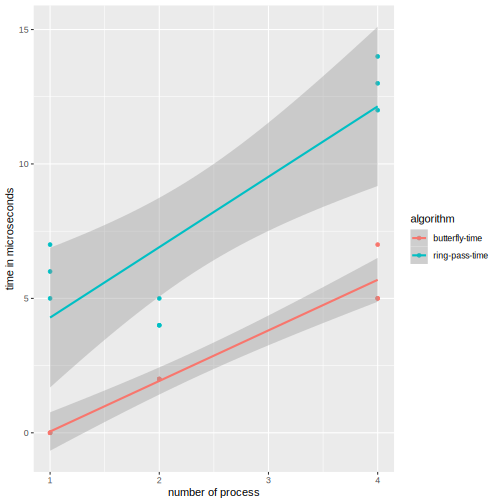

# Questão 12

An alternative to a butterfly-structured allreduce is a **ring-pass** structure. In a ring-pass, if there are $p$ processes, each process $q$ sends data to process $q + 1$, except that process $p − 1$ sends data to process $0$. This is repeated until each process has the desired result. Thus, we can implement allreduce with the following code:
```c
sum = temp val = my val;

for (i = 1; i < p; i++) {
    MPI_Sendrecv_replace(&temp_val, 1, MPI_INT, dest,
                        sendtag, source, recvtag, comm, &status);
    sum += temp val;
}
```
1.  Write an MPI program that implements this algorithm for allreduce. How does its performance compare to the butterfly-structured allreduce ?  
2.  Modify the MPI program you wrote in the first part so that it implements prefix sums.

## benchmark butterfly vs ring pass

### código

``` c title="bench.c"
--8<-- "docs/chapter_3/question_12/bench.c"
```

``` c title="run_bench.sh"
--8<-- "docs/chapter_3/question_12/run_bench.sh"
```

``` c title="plot_data.r"
--8<-- "docs/chapter_3/question_12/plot_data.r"
```

### gráficos

