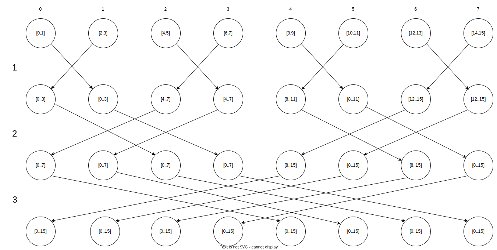

# questão 16

Suppose _comm_sz_ $= 8$ and the vector **x** $= (0, 1, 2, . . . , 15)$ has been distributed among the processes using a block distribution. Draw a diagram illustrating the steps in a butterfly implementation of allgather of **x**

## connections

para calcular os vizinhos foi criado o seguinte script

``` c title="connections.py"
--8<-- "docs/chapter_3/question_16/connections.py"
```
Saida do script
```bash
P_0 -> [1, 2, 4]
P_1 -> [0, 3, 5]
P_2 -> [3, 0, 6]
P_3 -> [2, 1, 7]
P_4 -> [5, 6, 0]
P_5 -> [4, 7, 1]
P_6 -> [7, 4, 2]
P_7 -> [6, 5, 3]
```
Lê-se o resultado da seguinte maneira,
processo $p$ envia dados para seus processos parceiros
onde o indicie da lista de processos parceiros representam as
fases. Depois foi desenhado o diagrama de acordo

## diagram
